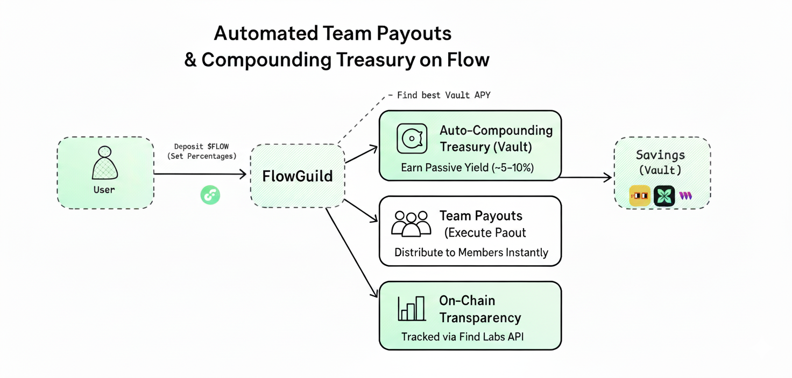

# FlowGuild — Automated Team Treasury & Payouts on Flow

Forte Hacks by Flow 2025 | DAO/Teams | Treasury Automation

- LIVE on Flow Testnet | Built for DAOs and Teams | Wallet-native UX

## Executive Summary

FlowGuild automates team/DAO payouts on Flow. Create a payout once, allocate member shares, and execute on-chain with full transparency. The app recontextualizes subscriptions into “guild payouts,” providing a professional dashboard, transparent activity feed, and visual tools for member share management.

- Key Impact: Replace manual spreadsheets and ad-hoc transfers with automated, auditable, on-chain payouts that scale with your team.

## What FlowGuild Delivers

- Automated Payouts: Create new guild payouts, define allocations, and execute instantly on Flow.
- Transparent Activity: Live, verifiable event feed (PayoutCreated, PayoutExecuted) via Find Labs indexer.
- Treasury Visibility: Total treasury balance (FLOW), total distributed, member distribution donut.
- Member Experience: Role-ready UI, public guild page option, connect-wallet onboarding.
- Smart Auto-Split: Suggest splits using historical payout patterns (Find Labs-powered).

## Architecture



- Frontend: Next.js 14 (App Router), TypeScript, Tailwind CSS, Framer Motion
- Flow Integration: FCL (Flow Client Library), Cadence contract (existing “subscription” functions repurposed as payouts)
- Indexing: Find Labs Events API for reliable historical event data
- Charts/Visuals: Recharts for Line/Bar/Donut
- Auth: Wallet connect (FCL + WalletConnect), `useFlowUser` hook

## Repository Structure (frontend)

```
frontend/flowsubs/
├── app/
│   ├── page.tsx                # Landing
│   ├── dashboard/page.tsx      # Guild dashboard
│   ├── payouts/page.tsx        # Create payout
│   ├── guild/[id]/page.tsx     # Public guild page (optional)
│   └── api/transactions/[address]/route.ts  # Find Labs events API
├── components/
│   ├── FlowAuthButton.tsx
│   └── ui/ (AppShell, Navbar, Footer, Chart, Donut, Timeline, StatsCard, etc.)
├── lib/
│   ├── flow-config.ts          # FCL config
│   ├── flow-scripts.ts         # On-chain queries (e.g., FLOW balance)
│   └── utils.ts
└── hooks/                      # `useFlowUser`, etc.
```

## Environment Variables

Copy the example and configure:

```
cp env.local.example .env.local
```

Required variables:

- `NEXT_PUBLIC_CONTRACT_ADDRESS=0xYourDeployerOnTestnet`
- `NEXT_PUBLIC_CONTRACT_NAME=SubscriptionManagerV2`
- `FINDLABS_API_BASE=https://api.findlabs.io` (default supported)
- `FINDLABS_API_KEY=...` (or `FINDLABS_USER` + `FINDLABS_PASS`)

Notes:

- UI maps Subscription events → Payout events for consistency
- Contract addresses should be Flow testnet unless you target mainnet

## Getting Started

Install and run the dev server:

```
npm install
npm run dev
```

Open http://localhost:3000.

### Connect Wallet

- Click “Connect Wallet” in the navbar or landing hero
- Uses FCL + WalletConnect providers configured in `lib/flow-config.ts`

### Create a Guild Payout

- Navigate to `/payouts`
- Enter total amount (FLOW), adjust member sliders, preview donut
- Optional: “Suggest Split” (Find Labs–powered history heuristic)
- Click “Execute Payout” to sign and submit

### View Dashboard

- Navigate to `/dashboard`
- KPIs: Total Treasury, Monthly Yield (placeholder), Total Distributed, Active Members
- Activity feed: PayoutCreated / PayoutExecuted with tx preview
- Member Share Distribution donut aggregates executed payouts

### Public Guild Page (optional)

- `/guild/[address]` shows read-only stats and activity

## Scripts

- `npm run dev` — Start Next.js dev server
- `npm run build` — Production build
- `npm run start` — Start production server
- `npm run lint` — Lint project

## Styling & UX

- Premium dark theme (Geist font). Theme tokens in `app/globals.css`:
  - `--background`, `--border`, `--card`, `--accent`, `--gradient-mesh`
- Components use “surface” classes for consistent dark cards
- Motion: subtle fade/slide and hover micro-interactions

## Data & Events

- Server route `api/transactions/[address]` fetches events from Find Labs:
  - Maps `SubscriptionCreated` → `PayoutCreated`
  - Maps `SubscriptionPaid` → `PayoutExecuted`
  - Maps `SubscriptionCanceled` → `PayoutCanceled`
- Fallback to access node is a stub for demo; rely on Find Labs for reliability

## Security & Trust

- Flow/Cadence resource model (in the target contract) ensures safety
- Transparent: All actions are on-chain and verifiable on Flowscan / Find Labs
- Minimal permissions; wallet-native interactions

## Roadmap

- Roles/Permissions (Admin/Member), approvals
- Templates for recurring payouts
- Enhanced analytics and time-series reporting
- Mainnet readiness (after audits)

## License

MIT

## Contact

- Author: Vaibhav — https://github.com/vaibhavxtripathi
- Questions/Issues: Please open a GitHub issue in this repository
